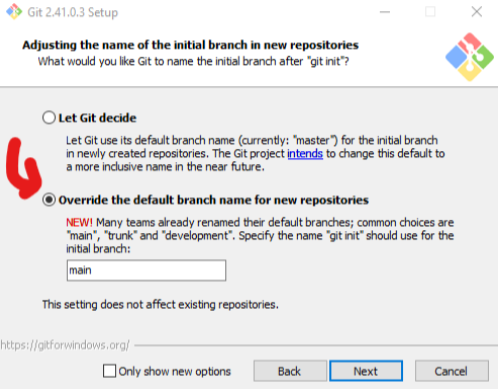

# Laboratorio-git

---

**Bloque:**
Modelación de la Ingeniería y Ciencias

**Nombre del entregable:**
Laboratorio Git: Resumen

**Grupo:**
105

**Profesor:**
Octavio Navarro

**Alumnos:**
- Diego Córdova Rodríguez, A01781166
- David Elías Bazán Calvillo, AO1785747
- Sebastián González Del Moral, A01786196

---

# Definiciones :monocle_face:

>**GitHub** es un sitio web mediante el cual se pueden crear repositorios; es decir, un lugar en el que puedes almacenar archivos y su respectivo historial de revisión.

>**Git** es un sistema de control de versiones. A través de esto, un clon local es un repositorio de control de versiones del proyecto subido a la nube de forma remota. Se puede utilizar para coolaborar o tener diferentes versiones de un mismo proyecto.

A través de los repositorios se puede trabajar en equipo, colaborar, trabajar en distintas revisiones o versiones de un mismo archivo, etc. Finalmente, se puede subir, descargar o clonar el repositorio (mediante comandos en Git o integraciones de Visual Studio Code).

*Logo de GitHub*

---

# Bitácora de progreso :chart_with_upwards_trend:

A lo largo de estas clases, nos hemos adentrado a los aspectos más básicos de **GitHub**; es decir, lo que comprende crear un repositorio. De igual forma, aprendimos a clonar un **repositorio**, un **SSH** y **subir los cambios** al repositorio remoto.

---

## Día 1

### Crear repositorio en GitHub

Directamente en GitHub, creamos un repositorio público con las siguientes características:

- Nombre: Laboratorio_git
- Público
- Agregar archivo README
- .gitignore: Nada
- Licencia: MIT License

### Instalar Homebrew :arrow_down:

**macOS:**
Entrar a la terminal a través del buscador de Spotlight. Una vez dentro, insertar el siguiente comando:
`/bin/bash -c "$(curl -fsSL https://raw.githubusercontent.com/Homebrew/install/HEAD/install.sh)"`.

**Windows**
No es necesario, se hace directamente desde el instalador

### Instalar Git :arrow_down:

**macOS**
En la terminal, insertar el comando `$ brew install git` para instalar la última versión de git.

**Windows**
Entrar a la [página oficial de Git](https://git-scm.com/downloads) y descargar el instalador para Windows.
**Una vez en el instalador no se debe cambiar nada más que el siguiente apartado:**

### Nombre y correo en Git :email:

Una vez Git está instalado, insertar los siguientes comandos:
`git config --global user.name “Nombre de usuario”`
`git config --global user.email “Email de usuario”`

*En el caso de MacOS, se seguirá trabajando en la terminal*
*En el caso de Windows, se hace en Git*

### Añadir Git al Path :book:

**macOS**
No es necesario realizar, todo se trabaja desde la terminal.

**Windows**
En el buscador de Windwos, buscar "path". Entrar a la primera opción e ir a:
*Environment Values/System Variables/Edit/New*

Si ya se encuentra Git, no realizar ningún cambio. Si no aparece se deberá copiar la dirección de instalación de Git.

### Crear SSH :key:

Secure SHell *(protocolo de red destinado a la conección con una computadora para acceder a ella a través de comandos)*.

**1. Generar SSH**

`ssh-keygen -t ed25519 -C "your_email@example.com"`

Después nos preguntó si deseabamos poner una contraseña para ejecutar cualquier acción futura; sin embargo, decidí no poner una por el momento.

**2. Verificar creación de SSH**

`eval "$(ssh-agent -s)"`

**3. Agregar llave privada SSH al ssh-agent**

Si no agregaste una llave privada puedes saltarte este paso. Si no, usar el siguiente comando:

`ssh-add ~/.ssh/id_ed25519`
*Sustituir "_id_ed25519" con el nombre de tu archivo de clave privada*

**3. Copiar SSH al portapapeles**

`ssh-add ~/.ssh/id_ed25519`

**4. Pegar SSH en GitHub**

En GitHub entrar a "*Configuration/SSH & GPG Keys/New SSH Key*":

*Se nos pedirá un nombre en clave para identificar el SSH*.

---

## Día 2

### Crear y clonar repositorio :floppy_disk:

Una vez creado y agregado el acceso por SSH, creamos una carpeta local y accedemos a ella a través del comando
`cd (ubicación de la carpeta)`

Algunos otros comandos importantes para ubicarla y revisar los archivos son los siguientes:
- `pwd`: imprime la carpeta en la que estoy trabajando en este momento
- `ls` - list: muestra los contenidos de la carpeta en la que estoy en este momento
- `ls -a`: list all - ver todos los archivos de la carpeta
- `cd "carpeta"`: changedirectory - le digo a qué carpeta me quiero mover
- `cat`: ver el contenido de un archivo

### Clonar repositorio remoto a una carpeta local :file_folder:

Estando dentro de la carpeta en la que se desea clonar el repositorio (Con el comando `cd "carpeta"`), usar el comando `git clone (url de la carpeta)`

*La url del repositorio se encuentra en la página main del repositorio en GitHub*.

---

## Día 3

### Subir contenido al repositorio :arrow_up:

Una vez clonado el repositorio de forma local, empezamos a subir archivos a la carpeta del repositorio, así como empezamos a editar algunos otros como es este propio archivo **README**.

Entre los comandos que utilizamos en esta última fase, se encuentran los siguientes (ejecutar en este orden):

- `git add -A`: Subir todos los cambios realizados a la zona de pruebas de git
- `git commit -m "Descripción"`: Comentar los cambios realizados. Se suben los cambios al repositorio local
- `git push -u origin main`: Sube todos los cambios ya comentados a la rama main del repositorio en Github.

### Trabajar desde VS Code :computer:

- Lo único que debemos hacer es abrir la carpeta y modificar los archivos que deseemos.
- Podemos hacer commits directamente desde VS Code
- *Es una forma más rápida y cómoda para trabajar*.

---

# Referencias

- [Descargar Git](https://git-scm.com/downloads)
- [¿Qué es Git?](https://learn.microsoft.com/es-es/devops/develop/git/what-is-git)
- [¿Qué son los repositorios?](https://docs.github.com/en/repositories/creating-and-managing-repositories/about-repositories)
- [Markdown Guide](https://www.markdownguide.org/)

- Markdown